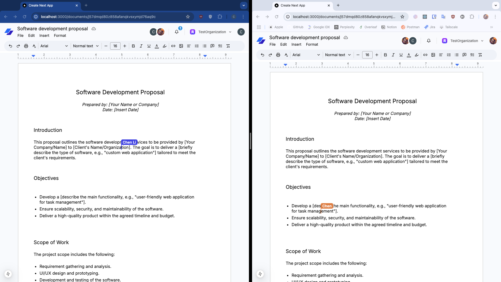

# Realtime Collaborative Documentation Platform

## Introduction
This is a NextJS project that can allow users to create documentations and collaborate online. The project is very similar to Google Doc and can be 100% used for personal or educational use.
It's free and very easy to be deployed. It uses a lot of third party tools for better experience and AI tools like ChatGPT in order to get more efficient and beautiful code.

The main features are:
1. Full function editor;
2. Full function user authentication and organization system;
3. Realtime database for realtime updating;
4. Full function collaboration including room, member list, colorful cursor mention, and comment threads;
5. An LLM driven AI Assistant for document writing and knowledge sharing;
6. Stripe integration for subscription and payment;

Try this platform at [here](https://docs-rho-ten.vercel.app)

Here is a screenshot for quick look.


## Tech Stack
1. For backend and frontend, NextJS 15 and React 19 RC are used;
2. For full function editor, Tiptap is used;
3. For realtime database for storing documents info, Convex realtime database is used;
4. For realtime document content updates and collaboration functionalities, Liveblocks realtime APIs are used;
5. For API authentication, User management, and Organization functionality, Clerks is used;
6. For UI reuseable components design, shadcnUI and lucuide-react are used for components and icons inspiration;

Some features which are common in lots of projects are not fully supported in this project, such as:
1. Dark mode. It's not difficult to implement dark mode for the project. But it will cause several difficulties. For example, print behavior won't be correct in dark mode. And it's not great to use document websites at night. Workers need rest;
2. Responsive UI for multi-device supports. It's not good to use document websites on mobile phones because it will be hard to use. Even Google Docs recommends users to use native mobile app instead of websites on mobile devices.

## Run Locally
First of all, clone the repository, enter to the repository and run
```bash
npm install --legacy-peer-deps
```
`--legacy-peer-deps` is used due to React 19 is still in RC stage. This can be dropped if React 19 is out of RC.

Then create `.env.local` file at the root of repository
```js
# Deployment used by `npx convex dev`
CONVEX_DEPLOYMENT=

NEXT_PUBLIC_CONVEX_URL=

# Clerk
NEXT_PUBLIC_CLERK_PUBLISHABLE_KEY=
CLERK_SECRET_KEY=

LIVEBLOCK_SECRET_KEY=

# OpenAI
OPENAI_API_KEY=
# Stripe
NEXT_PUBLIC_URL=http://localhost:3000
STRIPE_PUBLISHABLE_KEY=
STRIPE_SECRET_KEY=
STRIPE_WEBHOOK_SECRET=
```

The keys can be gotten from the official websites of Convex, Clerk and Liveblocks.

Finally, run `npm run dev` to start the development and `npx convex dev` to start the convex realtime database.

The project will run on `localhost:3000`.

## Deployment
It's recommended to host this project on `Vercel`.

1. Fork this project;
2. Get the keys from the official websites. It's recommended to use production environments for Convex and Liveblocks. Clerks can also be converted to production environments if there is own domain;
3. Deploy the project on Vercel. Follow Convex's documentation to config building command and the environment variables. Add `--legacy-peer-deps` option for install command.

## Acknowledgement
I appreciate all authors/teams of open-source projects that I used in this project.
I also learned a lot from repositories in Github to implement more efficient code.
I welcome all developers to read my code and give me more valuable suggestions.